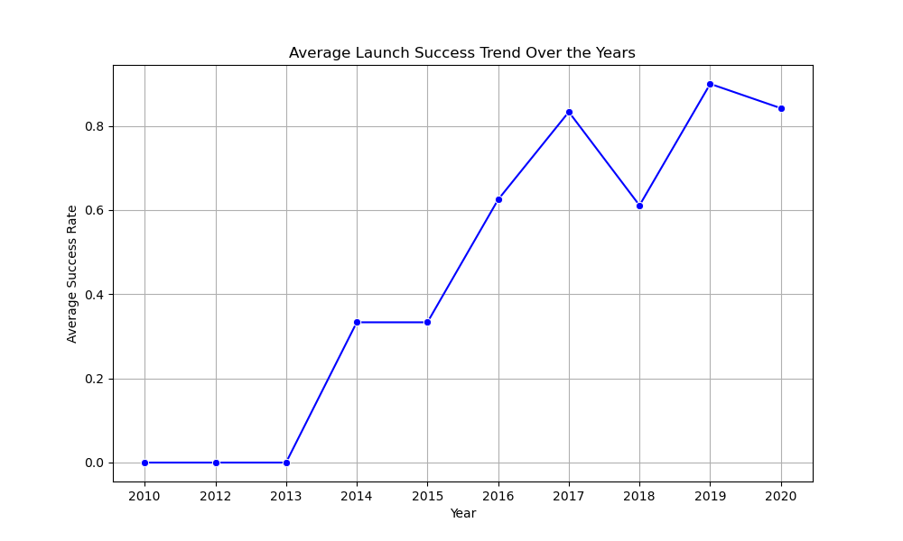

# First Stage Landing Prediction

   
## Data mining our Data set
|   FlightNumber | Date       | BoosterVersion   |   PayloadMass | Orbit   | LaunchSite   | Outcome     |   Flights | GridFins   | Reused   | Legs   | LandingPad               |   Block |   ReusedCount | Serial   |   Longitude |   Latitude |
|---------------:|:-----------|:-----------------|--------------:|:--------|:-------------|:------------|----------:|:-----------|:---------|:-------|:-------------------------|--------:|--------------:|:---------|------------:|-----------:|
|              1 | 2010-06-04 | Falcon 9         |        nan    | LEO     | CCSFS SLC 40 | None None   |         1 | False      | False    | False  |                          |       1 |             0 | B0003    |    -80.5774 |    28.5619 |
|              2 | 2012-05-22 | Falcon 9         |        525    | LEO     | CCSFS SLC 40 | None None   |         1 | False      | False    | False  |                          |       1 |             0 | B0005    |    -80.5774 |    28.5619 |
|              3 | 2013-03-01 | Falcon 9         |        677    | ISS     | CCSFS SLC 40 | None None   |         1 | False      | False    | False  |                          |       1 |             0 | B0007    |    -80.5774 |    28.5619 |
|              4 | 2013-09-29 | Falcon 9         |        500    | PO      | VAFB SLC 4E  | False Ocean |         1 | False      | False    | False  |                          |       1 |             0 | B1003    |   -120.611  |    34.6321 |
|              5 | 2013-12-03 | Falcon 9         |       3170    | GTO     | CCSFS SLC 40 | None None   |         1 | False      | False    | False  |                          |       1 |             0 | B1004    |    -80.5774 |    28.5619 |
## Exploratory data analysis
### Calculate the number of launches on each site

|              |   LaunchSite |
|:-------------|-------------:|
| CCSFS SLC 40 |           55 |
| KSC LC 39A   |           22 |
| VAFB SLC 4E  |           13 |

### Calculate the number and occurrence of each orbit
|       |   Orbit |
|:------|--------:|
| GTO   |      27 |
| ISS   |      21 |
| VLEO  |      14 |
| PO    |       9 |
| LEO   |       7 |
| SSO   |       5 |
| MEO   |       3 |
| ES-L1 |       1 |
| HEO   |       1 |
| SO    |       1 |
| GEO   |       1 |
## Data Visualization
### Detailed launch records of each site

### The relationship between Payload and Launch Site

### The relationship between success rate of each orbit type

### The relationship between FlightNumber and Orbit type

## Machine Learning
'''Accuracy on Test Data:
Logistic Regression: 0.7778
Support Vector Machine: 0.8889
Decision Tree: 0.8333
K-Nearest Neighbors: 0.7778

The method that performs best is Support Vector Machine with an accuracy of 0.8889
'''
